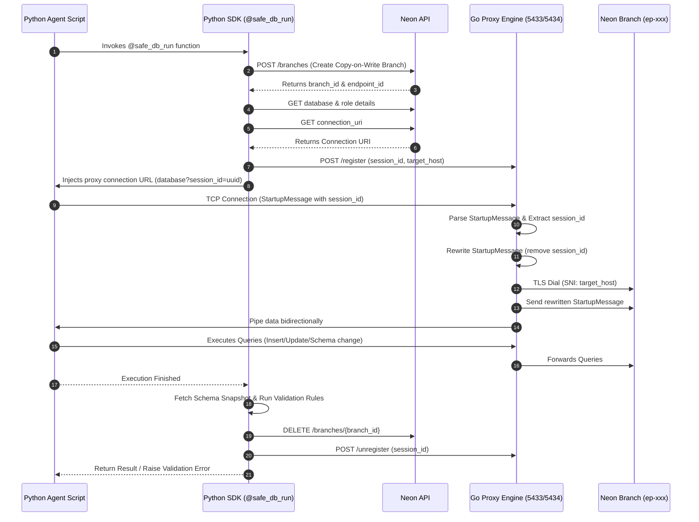

# Aegis: AI-Native Database Proxy MVP

Aegis is an AI-Native Database Proxy designed to secure, sandbox, and validate database interactions performed by LLM agents. Aegis dynamically intercepts database connection attempts, provisions isolated Copy-on-Write database branches (via the Neon API) for the duration of the agent's work, routes the connection to the sandbox branch, and executes strict validation rules before letting changes merge.

---

## Architecture Overview

Aegis is structured as a monorepo applying **Clean Architecture** principles, composed of:
1. **Go Proxy Engine (`/proxy-engine`)**: A Layer 4 TCP proxy listening on port `5433` and an admin HTTP server on port `5434`.
2. **Python SDK (`/python-sdk`)**: A client library and `@safe_db_run` decorator that wraps agent functions to automate branch provisioning, proxy registration, schema snapshot comparisons, and resource cleanup.

### End-to-End Traffic Routing Workflow



---

## Getting Started

### Dependencies & Setup
This project uses the Vitess SQL parser. Ensure your environment has Go installed and run 'go mod tidy' after installation.
```bash
go get vitess.io/vitess/go/vt/sqlparser
```

### Prerequisites
* Go (1.20+)
* Python (3.9+)
* A Neon database account and API token

### Environment Configuration
Create a `.env` file in the root of the project containing:
```env
# Neon API Settings
NEON_API_KEY=your_neon_api_key_here
NEON_PROJECT_ID=your_neon_project_id_here
NEON_BASE_URL=https://console.neon.tech/api/v2

# Aegis Proxy Settings (Optional Defaults)
AEGIS_PROXY_TCP_HOST=localhost
AEGIS_PROXY_TCP_PORT=5433
AEGIS_PROXY_HTTP_URL=http://localhost:5434
```

### Running the Go Proxy
Build and launch the proxy engine:
```bash
cd proxy-engine
go build -o aegis-proxy
./aegis-proxy
```
The proxy will start a database connection interceptor on port `5433` and an admin control HTTP API on port `5434`.

### Running with Docker & Monitor Mode
You can build and run the Aegis Proxy in a Docker container. By default, the proxy operates in `enforce` mode (which actively blocks queries). Set the `AEGIS_MODE` environment variable to `monitor` to run in shadow mode (which logs warnings instead of blocking queries).

Build the image:
```bash
docker build -t aegis-proxy .
```

Run the container in Monitor Mode:
```bash
docker run -d -p 5433:5433 -p 5434:5434 -e AEGIS_MODE=monitor aegis-proxy
```

### Using the Python SDK
Install the SDK dependencies:
```bash
cd python-sdk
pip install requests psycopg2-binary
```

Import and use the `@safe_db_run` decorator:
```python
from neon_provisioner import safe_db_run
import psycopg2

@safe_db_run
def run_agent_workflow(db_url: str):
    # This block executes inside an isolated copy-on-write database branch!
    # Connect via the Go proxy:
    conn = psycopg2.connect(db_url)
    with conn.cursor() as cur:
        cur.execute("CREATE TABLE orders (id SERIAL PRIMARY KEY, amount INT);")
        cur.execute("INSERT INTO orders (amount) VALUES (150);")
        conn.commit()
    conn.close()

if __name__ == "__main__":
    run_agent_workflow()
```

---

## Schema Merge Validation Rules

By default, the `@safe_db_run` decorator will snapshot the database schema *before* and *after* execution. It executes these rules:
1. **No Dropped Tables**: Prevents the agent from dropping tables.
2. **No Dropped Columns**: Prevents the agent from dropping columns in existing tables.
3. **Primary Key Enforcement**: All newly created tables must define a primary key.

If any rule is violated, a `ValueError` is raised, and the changes are rolled back. In all circumstances, the ephemeral branch is deleted from Neon.
