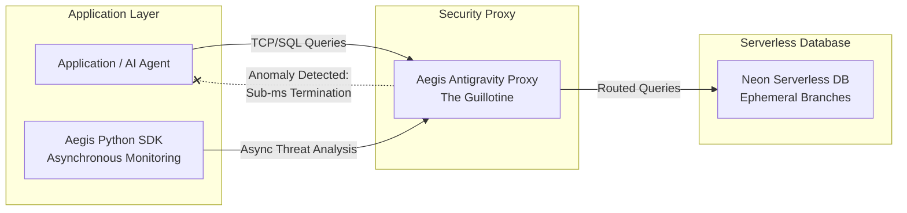

<div align="center">
  <h1>🛡️ Aegis Antigravity</h1>
  <p><b>Enterprise-grade, deterministic database security proxy for modern serverless architectures.</b></p>
  <p><i>Shift-Left Security. Zero Hallucinations. Sub-millisecond Response.</i></p>
</div>

---

Aegis Antigravity is a robust, AI-native database security proxy purpose-built for modern serverless databases like [Neon](https://neon.tech). Positioned as a true **"Shift-Left"** security tool, Aegis empowers developers to embed security directly into their data layer before production deployments. By intercepting database connections at the proxy layer, Aegis allows you to safely sandbox AI agents, execute adversarial testing, and deterministically block malicious queries—all without slowing down your application.

---

## ✨ Features

- **Deterministic Security**: Aegis relies on statistical **Z-score anomaly detection** rather than LLMs for threat analysis. This guarantees zero hallucinations, predictable performance, and mathematically sound security decisions.
- **The Guillotine**: Experience unprecedented control with **sub-millisecond session termination** directly at the proxy level. When an anomaly is detected, the connection is severed instantly before a destructive query can reach the database engine.
- **Zero-Latency Monitoring**: Never compromise on performance. The Aegis Python SDK calculates threats **asynchronously** off the main thread, ensuring your primary database interactions remain lightning fast.
- **Serverless Native**: Built from the ground up to integrate seamlessly with **Neon ephemeral branches**. This enables safe adversarial testing, isolated sandboxing for AI agents, and frictionless CI/CD integration.

---

## 🏗️ Architecture

Aegis operates at the network layer, sitting between your application (or AI agents) and your serverless database. It intercepts TCP connections, routes traffic to dynamic sandboxes, and asynchronously monitors query patterns.



---

## 🚀 Quick Start

Aegis is packaged as a lightweight, secure Docker container. Getting started takes only a few seconds.

### 1. Configure Environment

Create a `.env` file or export these variables in your terminal:

```bash
# Neon API Configuration
export NEON_API_KEY="your_neon_api_key_here"
export NEON_PROJECT_ID="your_neon_project_id_here"

# Aegis Proxy Configuration
export AEGIS_MODE="enforce" # Use 'enforce' to block, 'monitor' to shadow
export AEGIS_PROXY_TCP_PORT="5433"
export AEGIS_PROXY_HTTP_PORT="5434"
```

### 2. Run the Aegis Proxy

Launch the proxy using Docker:

```bash
docker run -d \
  --name aegis-proxy \
  -p 5433:5433 \
  -p 5434:5434 \
  -e NEON_API_KEY="${NEON_API_KEY}" \
  -e NEON_PROJECT_ID="${NEON_PROJECT_ID}" \
  -e AEGIS_MODE="${AEGIS_MODE}" \
  aegis-proxy:latest
```

Your database traffic routed through `localhost:5433` is now secured by Aegis Antigravity.

---

## 🐍 Python SDK Usage

The Aegis Python SDK provides a seamless developer experience. Using the `@safe_db_run` decorator, you can effortlessly provision isolated database branches and route connections through the proxy—ideal for safely executing AI agent workflows.

### Installation

```bash
pip install aegis-sdk
```

### Example: Securing an AI Agent

```python
import psycopg2
from aegis_sdk.neon_provisioner import safe_db_run

# The decorator automatically provisions a Neon ephemeral branch,
# sets up routing through Aegis, and injects the secure connection string.
@safe_db_run
def autonomous_agent_task(proxy_conn_string: str):
    print(f"Connecting to sandbox via Aegis: {proxy_conn_string}")
    
    # Connect using the secure, proxy-routed connection string
    conn = psycopg2.connect(proxy_conn_string)
    cursor = conn.cursor()
    
    # Execute queries safely. Aegis monitors asynchronously.
    # If the Z-score anomaly detector flags malicious behavior, 
    # "The Guillotine" terminates the session in <1ms.
    cursor.execute("SELECT * FROM users LIMIT 5;")
    results = cursor.fetchall()
    
    print("Agent task completed safely.")
    return results

if __name__ == "__main__":
    autonomous_agent_task()
```

---

<div align="center">
  <p>Built with 🛡️ for secure, AI-native infrastructure.</p>
</div>
