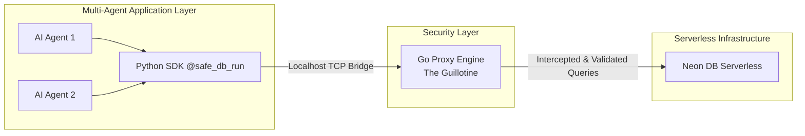

<div align="center">
  <h1>🛡️ Aegis Antigravity</h1>
  <p><b>Enterprise-grade, deterministic database security proxy for modern serverless architectures.</b></p>
  <p><i>Shift-Left Security. Zero Hallucinations. Sub-millisecond Response.</i></p>
</div>

---

Aegis Antigravity is a robust, AI-native database security proxy purpose-built for modern serverless databases like [Neon](https://neon.tech). Positioned as a true **"Shift-Left"** security tool, Aegis empowers developers to embed security directly into their data layer before production deployments. By intercepting database connections at the proxy layer, Aegis allows you to safely sandbox AI agents, execute adversarial testing, and deterministically block malicious queries—all without slowing down your application.

## 🌟 Gold Standard Developer Guide

Welcome to the Aegis project! This README serves as the ultimate onboarding guide for junior developers and system architects alike. It covers everything from our core architecture to the deployment pipeline.

---

## 🏗️ Multi-Agent Architecture

Aegis is designed to support a **Multi-Agent Workflow** where several autonomous AI agents can operate simultaneously without cross-contamination. 
- **Sandboxed Execution:** Every agent interaction is securely sandboxed in a dedicated Copy-on-Write (CoW) ephemeral branch provisioned via the Neon API.
- **Z-Score Anomaly Detection:** Agents' queries are mathematically analyzed in real-time. If an agent hallucinates a destructive query (e.g., `DROP TABLE`), Aegis's Z-score engine detects it deterministically.
- **The Guillotine:** Once a threat is detected, the proxy severs the TCP connection in sub-milliseconds, neutralizing the agent's database access instantly.

---

## 🌉 Go/Python Bridging Mechanism

Aegis seamlessly bridges high-performance systems-level intercept logic with accessible data-science workflows.

1. **The Go Proxy Engine (Layer 4):**
   Written in Go utilizing Clean Architecture. It binds to local ports (e.g., `5433` for TCP, `5434` for HTTP metrics) and intercepts PostgreSQL wire-protocol traffic. It strips custom session parameters, performs zero-latency threat analysis asynchronously, and dials out to the target serverless database.
   
2. **The Python SDK (Application Layer):**
   Developers or AI agents use the Python SDK (`aegis-sdk`). Using the `@safe_db_run` decorator, the SDK automatically provisions an ephemeral branch, configures the agent's connection string to point to the local Go Proxy instead of directly to the DB, and manages the lifecycle of the test.



---

## 🚀 CI/CD Deployment Pipeline

Aegis utilizes a hardened CI/CD infrastructure for enterprise-grade distribution:
- **Continuous Integration:** Every commit to the `main` branch or pull request triggers a suite of unit tests, AST parser verifications, and Python integration tests.
- **Docker Publishing:** Through `.github/workflows/docker-publish.yml`, the pipeline builds multi-architecture Docker images (ARM64 & AMD64) and pushes them to Docker Hub. 
- **Semantic Versioning:** The `scripts/release.py` utility strictly enforces semantic versioning (e.g., `v1.0.11`). Users can pull the `latest` tag for rolling updates or pin a specific version for production stability.

---

## 🛠️ Quick Start for Developers

Getting the stack running locally for development and testing takes only a few minutes.

### 1. Configure Environment
Create a `.env` file in the root directory:
```bash
# Neon API Configuration
export NEON_API_KEY="your_neon_api_key_here"
export NEON_PROJECT_ID="your_neon_project_id_here"

# Aegis Proxy Configuration
export AEGIS_MODE="enforce" # 'enforce' (blocks) or 'monitor' (shadows)
export AEGIS_PROXY_TCP_PORT="5433"
export AEGIS_PROXY_HTTP_PORT="5434"
```

### 2. Run the Go Proxy (Docker)
We recommend running the proxy in Docker during SDK development:
```bash
docker run -d \
  --name aegis-proxy \
  -p 5433:5433 \
  -p 5434:5434 \
  -e NEON_API_KEY="${NEON_API_KEY}" \
  -e NEON_PROJECT_ID="${NEON_PROJECT_ID}" \
  -e AEGIS_MODE="${AEGIS_MODE}" \
  raymondartin2/aegis-proxy:latest
```

### 3. Run Python Agent Integration Tests
With the proxy running, test the Python SDK's bridging capabilities:
```bash
cd python-sdk
pip install -r requirements.txt # or manually via pip
python test_sdk.py
```

---

## 📚 Further Reading
- **`AGENTS.md`**: Machine-readable specifications and boundaries for AI coding assistants contributing to this repository.
- **`INTERNAL_NOTES.md`**: Private runbooks, deployment guides, and troubleshooting steps.
